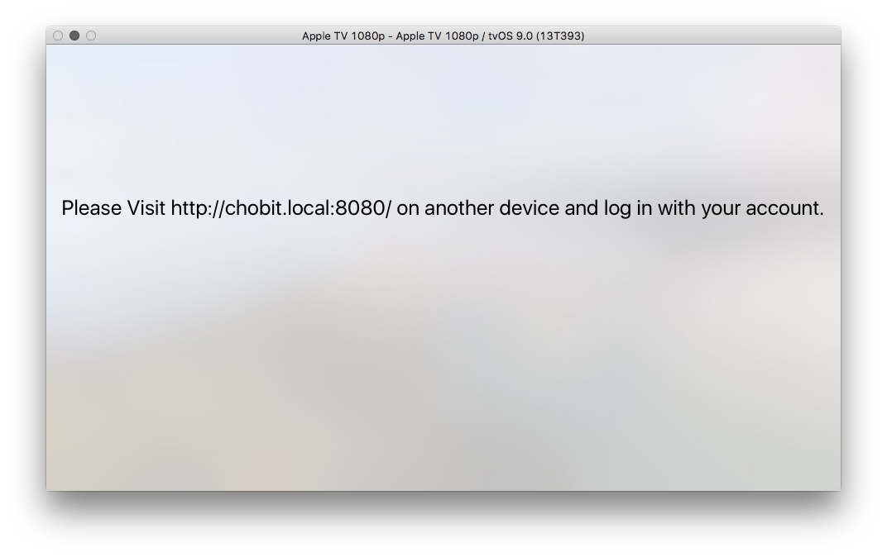
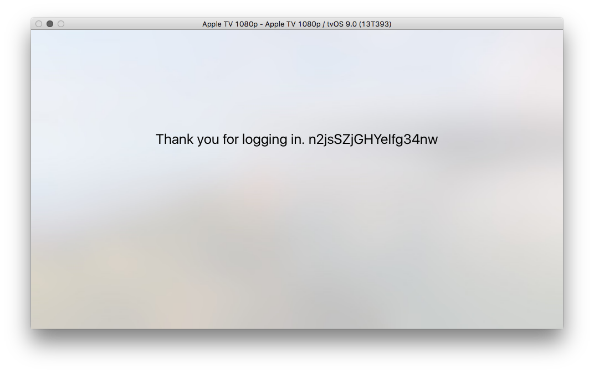

# OAuth Example
How to use OAuth on the Apple TV. Because Apple TV does not ship with a browser the authorization has to be done on a seperate device.

** Works only with services that let you define a callback in the local network.**

# OAuth 1.0 example with goodreads

1. Start a webserver on apple tv
2. get a request token for OAuth
3. tell the user to open the site in on another device
4. redirect user to the authentication page, with a callback to our server
http://www.goodreads.com/oauth/authorize?oauth_callback=...&mobile=1&oauth_token=...
5. Parse oauth token from the callback
http://yourapp.com/goodreads_oauth_callback?oauth_token=ezBHZc7C1SwvLGc646PEQ&authorize=1

# Screenshots

# Problems
* I could not test bonjour discovery in the simulator.
* Port 80 is blocked.

# Credits
* [HTTP Server GCDWebServer](https://github.com/swisspol/GCDWebServer)
* [OAuth library for swift](https://github.com/dongri/OAuthSwift)
* [Goodreads API](https://www.goodreads.com/api/documentation#oauth)